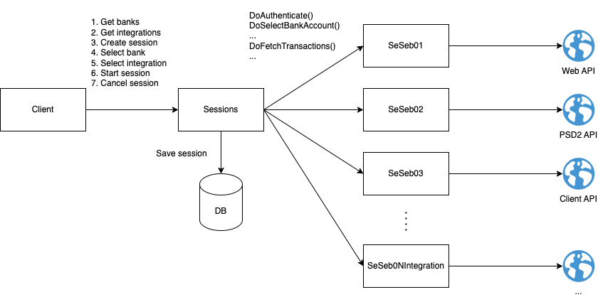
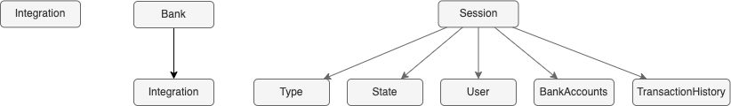
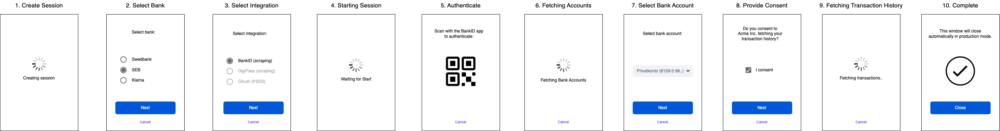

# open-banking-poc

A proof-of-concept for integrating with banks to perform AIS and/or PIS according to the PSD2 directive.

## Purpose

This project was created partly for [my portfolio of projects](https://davidrunemalm.com).

Reach out using the contact details on my portfolio page if you are interested in getting to know more about the project.

## Key Features

- ✅ Simple monolithic architecture.
- ✅ Prepared for microservices.
- ✅ One developer per bank integration.
- ✅ Javascript SDK for website integration.

## Demo

Check out the demo by authorizing against your own bank or a mock bank (no credentials required for the latter) at the [demo page](https://davidrunemalm.com/open-banking-demo).

## Architecture Overview

There's a simple monolith *backend*, which exposes an api for the frontend client to drive bank integration session.

The *frontend* is a simple SPA application built with React.

There's a *JavaScript SDK* for easily integrating the session client with any website.

## Data Flow

The figure below illustrates the data flow.

The client is a website that uses the JS SDK to open a client widget. This client will make requests to the **Sessions** backend to drive a user session with a bank. The session backend uses an **integration** subclass to talk to the bank.

## Basic Entities

These are the basic entities:

**Session** represents the session a PSU (user) has with selected bank to perform an AIS/PIS service session.

**Bank** represents a bank in a country.

**Integration** represents a bank integration.

## State Machine

The session is defined and implemented as a state machine. The backend implements states, signals and transiations on the *Session* entity class. The frontend client maps it's views directly to session states. Each bank integration implements relevant state entry actions in it's subclass methods to make the communication with the bank.

## Frontend

The frontend is a JavaScript client SDK built using React and ready to drop-in for easy website integration.

Check out the [demo page](https://davidrunemalm.com/open-banking-demo) for code example on how to use the SDK.

## Backend

The backend is written using C# and .NET8. It's a monolith with a simple HTTP API. It uses Hangfire to schedule jobs for running the sessions with the banks asynchronously.

For future scaling, instead of running these jobs with Hangfire they could be run in separate distributed services, or even cloud functions.

You may find the [swagger API here](https://sessions-backend-102101218198.europe-north1.run.app/swagger/index.html).

## Bank Integrations

Each bank integration is implemented in a subclass of the *StateMachineBase* class. Thus, a new bank integration is as simple to add as adding one of these subclasses. You can see an example of a bank integration in the [SeSeb01](https://github.com/runemalm/open-banking-poc/blob/master/Backend/src/Sessions/Infrastructure/Integrations/Se/Seb/SeSeb01.cs) class.
