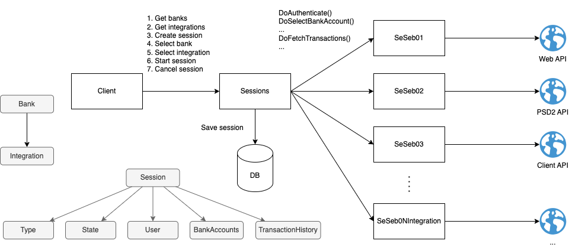

# open-banking-poc

A proof-of-concept for integrating with banks to perform AIS and/or PIS according to the PSD2 directive.

## Purpose

This project was created partly for [my portfolio of projects](https://davidrunemalm.com).

Reach out using the contact details on my portfolio page if you are interested in getting to know more about the project.

## Key Features

- ✅ Simple monolithic architecture.
- ✅ Prepared for microservices.
- ✅ One developer per bank integration.
- ✅ Javascript SDK for website integration.

## Demo

Check out the demo by authorizing against your own bank or a mock bank (no credentials required for the latter) at the [demo page](https://davidrunemalm.com/open-banking-demo).

## Architecture

There's a simple monolith *backend*, which exposes an api for the frontend client to drive bank integration session.

The *frontend* is a simple SPA application built with React.

There's a *JavaScript SDK* for easily integrating the session client with any website.

## Session

*Session* is the basic concept that is used to integrate with the banks. The frontend client will create and start a session. The backend will asynchronously run this session with the selected bank in the background. Input is provided to the session by the client when requested by the integration. State updates is polled from the backend by the frontend client. When a session is completed or failed, the integrating website is notified by the sdk client and the client window is closed.

## State Machine

The state machine defines the states and transitions of each session. It's represented in the Session.cs class (backend), the ui flow (frontend) and each bank integration subclass, as state entry actions for authenticate, get transaction history, etc.

## Frontend

The frontend is a JavaScript client SDK built using React and ready to drop-in for easy website integration.

Check out the [demo page](https://davidrunemalm.com/open-banking-demo) for code example on how to use the SDK.

## Backend

The backend is written using C# and .NET8. It's a monolith with a simple HTTP API. It uses Hangfire to schedule jobs for running the sessions with the banks asynchronously.

For future scaling, instead of running these jobs with Hangfire they could be run in separate distributed services, or even cloud functions.

## Bank Integration

Each bank integration is implemented in a subclass of the *StateMachineBase* class. Thus, a new bank integration is as simple to add as adding one of these subclasses. You can see an example of a bank integration in the [SeSeb01](https://github.com/runemalm/open-banking-poc/blob/master/Backend/src/Sessions/Infrastructure/Integrations/Se/Seb/SeSeb01.cs) class.
